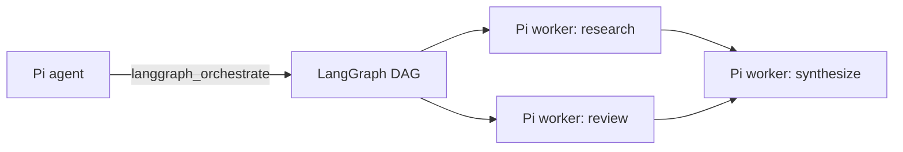

# pi-langgraph

A Pi extension that uses [LangGraph.js](https://docs.langchain.com/oss/javascript/langgraph/overview) for orchestration while keeping Pi in charge of execution.

LangGraph owns task topology, concurrent fan-out, dependency joins, reduced state, failure routing, and cancellation propagation. Pi workers still own model calls, coding tools, permissions, session behavior, and execution logs.



## Install

Install from GitHub:

```bash
pi install git:github.com/ThewindMom/pi-langgraph
```

Try it without installing:

```bash
pi -e git:github.com/ThewindMom/pi-langgraph
```

Senpi uses the same package format:

```bash
senpi install git:github.com/ThewindMom/pi-langgraph
```

For local development:

```bash
bun install
pi -e ./src/index.ts
```

## Tool

The extension registers `langgraph_orchestrate`.

```json
{
  "objective": "Research two options and recommend one",
  "failurePolicy": "fail-fast",
  "tasks": [
    {
      "id": "option_a",
      "prompt": "Research option A"
    },
    {
      "id": "option_b",
      "prompt": "Research option B"
    },
    {
      "id": "recommend",
      "prompt": "Compare the dependency results and recommend one option",
      "dependsOn": ["option_a", "option_b"]
    }
  ]
}
```

Independent tasks run concurrently. A task with multiple dependencies starts only after every dependency finishes. Results are returned in declaration order, regardless of completion order.

Each task supports:

- `id`: stable DAG node id.
- `prompt`: self-contained worker assignment.
- `dependsOn`: prerequisite task ids.
- `agent`: optional native agent type understood by the host.
- `model`: optional model override understood by the host.

Plans are limited to 32 tasks and rejected before execution when ids are duplicated, dependencies are unknown, or the graph contains a cycle.

## Failure policies

- `fail-fast` (default): reject the graph when a worker fails. Already-running parallel workers may finish while LangGraph unwinds.
- `continue`: record the failure and pass it to dependent tasks as an error dependency result.

The outer Pi `AbortSignal` is forwarded into LangGraph and every worker.

## Runtime adapters

### Pi

Upstream Pi does not expose an extension API for invoking another registered tool. The extension therefore creates in-memory child sessions through Pi's public SDK. Child sessions inherit the current working directory and model, use normal Pi tools, and exclude `langgraph_orchestrate` to prevent recursive orchestration.

### Senpi

Senpi exposes `ExtensionAPI.executeTool`. When its native `task` tool is active, the extension executes every graph node through that tool, preserving Senpi's validation, lifecycle hooks, permissions, progress events, cancellation, and task-agent logs. When `task` is unavailable, it uses the bundled Pi SDK session adapter instead.

## Development

```bash
bun test
bun run check
```

`bun test` covers graph validation, concurrent fan-out, dependency joins, failure propagation, and cancellation. `bun run check` runs strict TypeScript checking and a Bun production build.

## License

MIT
