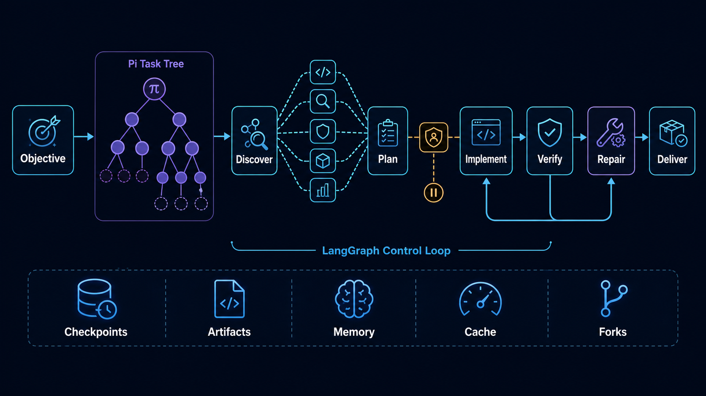

# pi-langgraph

`pi-langgraph` is a coding-first LangGraph extension for Pi and Senpi. Give it a normal software objective; the trusted compiler owns graph topology, bounds, routing, and validation.



## Install and run

```bash
pi install git:github.com/ThewindMom/pi-langgraph
pi -e git:github.com/ThewindMom/pi-langgraph
senpi install git:github.com/ThewindMom/pi-langgraph
```

Local development uses Bun: `bun install` then `pi -e ./src/index.ts`.

### Just ask normally

Once the extension is loaded and `langgraph_orchestrate` is active, its routing guidance is included in Pi's system prompt. Pi silently selects it for substantive repository work that benefits from discovery, parallel analysis, implementation plus verification, or review synthesis. You do not need to name the extension, write a task list, or describe a graph.

```text
Implement account settings across the UI, API, database, and tests.
```

Other normal prompts work the same way:

```text
Review this repository for authentication vulnerabilities.
Fix the flaky checkout tests and verify the complete payment flow.
Refactor the persistence layer without changing its public API.
```

Tool selection is still a model decision, not a deterministic prompt interceptor. Naming `pi-langgraph` is therefore an optional override if a model misclassifies an ambiguous request; it is not the normal usage contract. If the tool is disabled or the extension was not loaded, Pi cannot select it automatically.

The public tool accepts an objective-first coding request (or the legacy explicit DAG):

```json
{"objective":"Implement account settings UI, API, persistence, and tests","workflow":"delivery","maxIterations":2,"approval":"before_changes"}
```

`workflow` is `auto`, `delivery` (mutation plus verification), or `review` (read-only). `maxIterations` is 0–5. `approval: "before_changes"` creates a durable interrupt before the first mutation. Supply `threadId` for a stable thread. A paused run is inspected with `{"resumeThreadId":"…"}` and resumed only after a later user decision by echoing the interrupt's complete structured binding with `action: "approve"` or `"reject"`. There is no boolean approval shortcut for an agent to self-submit. The model cannot supply nodes, edges, retries, timeouts, recursion limits, or routes.

## Architecture and execution contract

The graph uses typed reduced state, private specialist subgraphs, LangGraph runtime `Send` fan-out, `Command` routing, bounded cycles, per-node retry/timeout policy, and checkpointed process-restart resume. A normal delivery proceeds through these phases:

1. **Automatic activation.** Pi sees the active tool's system-prompt guidance and submits one objective-first `langgraph_orchestrate` call. The model supplies the objective and, only when useful, `workflow`, `maxIterations`, or `approval`; it cannot supply topology or runtime policy.
2. **Safe compilation.** The extension parses the boundary input, selects read-only `review` when the objective contains only review/audit language and otherwise selects `delivery`, fixes the repair and recursion bounds, and creates typed initial state.
3. **Repository discovery.** A Pi child worker inspects the repository and returns bounded work items, acceptance criteria, and optionally a versioned execution plan. Worker lifecycle events are attached to distinct child identities in Pi's task tree.
4. **Dynamic specialist fan-out.** LangGraph `Send` starts one private specialist subgraph per work item. These leaves run concurrently and read only from disposable copies of the same repository snapshot. Their structured findings merge deterministically.
5. **Bounded replanning.** Specialists may discover additional subsystems. The collector validates and deduplicates those proposals, respects the global work-item cap, and permits at most two expansion rounds rather than allowing unbounded graph growth.
6. **Typed plan validation.** A supplied plan is parsed into ordered changes with stable IDs, append-only revisions, file scopes, dependencies, risk levels, and package-script acceptance checks. Unknown dependencies, cycles, unsafe paths, conflicting revisions, and out-of-scope changes fail before mutation.
7. **Dependency-aware change execution.** The runtime selects the next dependency-ready change. Independent analysis remains parallel, but repository mutation is serialized so two workers never race to publish overlapping edits.
8. **Human approval when required.** Explicit `before_changes` policy or a scoped risk boundary creates a durable LangGraph interrupt. The response contains an exact thread/plan/change/scope binding. Only a later user message carrying that binding can approve or reject it; an agent cannot self-approve with a boolean shortcut.
9. **Isolated implementation.** The Pi worker receives an isolated working directory containing the exact dirty repository snapshot and independent Git metadata. Its structured report must exactly match the observed filesystem delta and the plan-authorized paths before any result can be published.
10. **Durable mutation claim.** Before implementation or repair, the saver records the logical operation. A completed operation replays its recorded result after restart; an indeterminate crash window routes to verification instead of blindly invoking the same mutation again.
11. **Trusted verification.** Per-change acceptance scripts and final integration checks run through the host evidence runner. Exit status, not worker prose, determines pass/fail. Bounded stdout and stderr become content-addressed artifact references.
12. **Conditional repair.** A failed aggregate verification routes through read-only diagnosis and then a new, scoped repair operation. The graph returns to verification until checks pass or the finite repair budget is exhausted. Per-change failures retry only that change while completed dependencies remain reusable.
13. **Evidence-based delivery.** Synthesis can use only typed findings, recorded changes, host verification, artifacts, and unresolved risks. Passing checks produce `completed`; rejection or exhausted repair produces resumable `needs_attention`, never a false success.
14. **Streaming and durability.** Throughout the run, LangGraph `updates`, `custom`, `tasks`, and `checkpoints` are projected into ordered, namespaced events with one terminal event. Checkpoints preserve successful siblings, pending interrupts, state history, and restart/resume position.

For a `review` workflow, the graph stops after discovery, specialist analysis, optional replanning, and evidence synthesis. It never enters approval, implementation, or repair.

Host verification—not worker assertions—determines pass/fail. stdout and stderr are captured as bounded content-addressed artifacts; results carry artifact references (digest, byte count, truncation), check status, and risks. A delivery result is `completed` only when all reported checks pass; otherwise it is `needs_attention` with retained evidence.

Pi workers own model calls, repository tools, permissions, and edits. If the host exposes `executeTool` and an active native `task` tool, that pipeline is used. Otherwise a Pi SDK child session is created in memory, inherits workspace/model, and excludes `langgraph_orchestrate` to prevent recursion. Explicit per-task agent/model overrides are rejected by the SDK fallback rather than silently ignored.

Every autonomous leaf runs in a disposable isolated copy of the current repository, including its dirty and ignored state and independent Git metadata. Read-only leaves publish nothing. A successful mutation is parsed and compared with the isolated filesystem delta, staged against an exact dirty baseline, then only its exact plan-authorized paths are copied back if those source paths have not changed concurrently. Concurrent source edits reject the stale worker but are preserved byte-for-byte. Worker failure, policy violation, ignored-file edits, Git/index/ref edits, or an inaccurate change report publish nothing; isolation-policy errors are not retried.

This is a transactional publication boundary, not an OS security sandbox. The extension cannot prove whether an in-process `TaskExecutor`, an absolute escaping symlink, or the user caused a live source change while a worker ran. It therefore never rolls back worker-time source changes: current bytes are preserved and the stale worker is rejected as a conflict. Rollback is limited to paths whose live identity exactly matches a candidate the extension itself published; newly created parent directories are removed only when empty. Run untrusted executors inside an actual process/container sandbox.

## Durable state, memory, and retention

Under `<agent-dir>/extensions/pi-langgraph/data/` the extension stores:

```text
checkpoints/                 durable LangGraph checkpoint files
artifacts/                   content-addressed stdout/stderr and evidence blobs
repositories/<sha256-root>/  cache/, memory/, retention/ per repository snapshot
forks/                       isolated Git worktrees and fork manifests
```

Checkpoint persistence is file format v3. It uses atomic replacement, POSIX `0700` directories and `0600` files, per-thread cross-process lock files, stale-owner recovery, and `fsync` before lock/checkpoint publication. Pending writes are deduplicated and retained across restart. A malformed checkpoint is quarantined and reported for that thread; healthy threads continue. The 8 MiB per-thread admission limit is fail-closed (it is not compaction). Terminal successful checkpoints may be removed after result materialization; interrupted, failed, approval-paused, and `needs_attention` threads remain resumable.

Repository memory is keyed by an exact repository snapshot and stores provenance (source checkpoint, observed time, confidence, and artifact refs). It is injected as explicitly untrusted dependency context. The read-only cache is keyed by snapshot, normalized input, operation, and policy; only discovery/specialist reads may be cached. Reachability retention pins thread/cache/fork owners and compacts only artifacts unreachable from retained owners.

`list` returns retained thread IDs; `history` returns checkpoint phase/history entries. `fork` requires an existing checkpoint, a clean Git source at the supplied 40- or 64-hex `gitCommit`, and a new `forkThreadId`; it clones checkpoint/pending-write state into an isolated worktree. Source and fork have separate `gitCommit` and `checkpointId` identities, and forking never auto-publishes or pushes changes.

## Compatibility and limits

The original `{objective,tasks:[{id,prompt,dependsOn,…}],failurePolicy}` DAG remains a migration path with deterministic static fan-out/join. It is not the autonomous objective-first workflow. The extension provides at-most-once mutating-worker invocation through durable claims, not exactly-once filesystem effects: a crash can happen before an edit or midway through one, so verification is authoritative. File persistence is intended for a local extension directory; this is not a production database, distributed lock service, power-loss durability guarantee, or protection from other privileged processes/users, malware, backups, or forensic access. Plain in-memory checkpointers are process-local only.

## QA

Verified with Node `>=22.19.0` and Bun `1.3.14`:

```bash
bun test
bun run check
```

Focused flow matrix:

| Scenario | Command |
| --- | --- |
| Objective compilation, dynamic Send/replan, typed plan/per-change loop | `bun test test/per-change-workflow.e2e.test.ts test/dynamic-replan.e2e.test.ts` |
| Streaming and dynamic/approval interrupts | `bun test test/streaming.e2e.test.ts test/dynamic-interrupt.e2e.test.ts test/approval-resume.e2e.test.ts` |
| Checkpoint v3, lock/fsync, restart and pending-write recovery | `bun test test/persistence-v3.test.ts test/checkpoint-concurrency.test.ts test/durable-map-resume.e2e.test.ts` |
| Host evidence/artifact refs, repository memory, read-only cache, retention compaction | `bun test test/evidence.test.ts test/repository-memory.test.ts test/read-only-cache.test.ts test/reachability.test.ts test/artifact-store.test.ts` |
| list/history/fork and clean Git isolation | `bun test test/public-runtime.e2e.test.ts test/workflow-fork.e2e.test.ts` |
| Native Pi task and SDK fallback roles | `bun test test/pi-flows.e2e.test.ts test/executors.test.ts` |

## License

MIT
