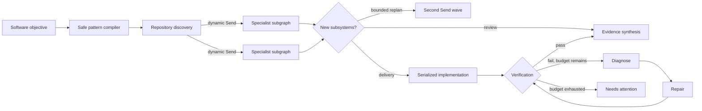

# pi-langgraph

A coding-first LangGraph runtime for Pi and Senpi. Give it a normal software objective; the extension compiles that objective into a trusted workflow instead of asking the model to invent raw nodes and edges.



LangGraph is load-bearing here: typed reduced state, private specialist subgraphs, runtime `Send` fan-out, `Command` routing, bounded cycles, per-node retry/timeout policy, synchronous checkpoints, human approval interrupts, history, and process-restart resume are all part of the execution contract.

Pi workers still own model calls, repository tools, permissions, and coding actions. Parallel workers are read-only specialists; repository mutation is deliberately serialized.

## Install

```bash
pi install git:github.com/ThewindMom/pi-langgraph
```

Try it without installing:

```bash
pi -e git:github.com/ThewindMom/pi-langgraph
```

Senpi uses the same package format:

```bash
senpi install git:github.com/ThewindMom/pi-langgraph
```

For local development:

```bash
bun install
pi -e ./src/index.ts
```

This is an extension package: Pi/Senpi loads the `pi.extensions` entry from the published TypeScript source. Bare `import "pi-langgraph"` is not a supported library surface; exported helpers are for repository tests and advanced source-level integration until a compiled library entry is defined.

## Use

Ask for the work normally:

```text
Implement the account settings screen, API, persistence, and tests.
```

The primary agent calls `langgraph_orchestrate` with the objective. The normal autonomous input is intentionally small:

```json
{
  "objective": "Implement the account settings screen, API, persistence, and tests",
  "workflow": "auto",
  "maxIterations": 2,
  "approval": "none"
}
```

- `workflow`: `auto`, `delivery`, or read-only `review`.
- `maxIterations`: zero to five repair iterations. The compiler also derives a finite recursion limit.
- `approval`: use `before_changes` to checkpoint after analysis and pause before mutation.
- `threadId`: optional stable ID for programmatic resume. Otherwise the extension generates and reports one.

The model cannot set node names, edges, retry policy, timeouts, recursion limits, or routes. Worker JSON is parsed at every boundary with finite sizes, lexical IDs, exact fields, and semantic consistency checks.

### Approval and resume

An approval-paused workflow returns `awaiting_approval` with its thread ID. Resume it after approval:

```json
{
  "resumeThreadId": "the-returned-thread-id",
  "approved": true
}
```

The same resume input continues a workflow interrupted by cancellation, provider failure, or process restart. Successful sibling work from a failed dynamic superstep is retained as pending checkpoint writes and is not repeated.

### Results

Terminal results include:

- discovered work units and structured findings;
- implementation and repair change sets;
- observed verification checks and evidence;
- unresolved risks and bounded iteration count;
- a semantic route trace;
- for completed workflows, a final synthesis constrained to the recorded evidence.

A delivery workflow cannot report `completed` unless every reported verification check passes. Exhausting the repair bound returns `needs_attention` with the retained verification evidence and a bounded terminal risk summary, never a false success. Resuming that terminal thread is idempotent inspection; start a new objective to authorize another repair budget.

## Durability and privacy

Checkpoints live under the Pi agent directory:

```text
<agent-dir>/extensions/pi-langgraph/data/checkpoints/
```

The included saver delegates checkpoint and pending-write semantics to the version-matched LangGraph `MemorySaver`, then atomically persists its representation in per-thread files. Directories use mode `0700` and files `0600` on POSIX. Successful terminal checkpoints are deleted after the sanitized result is materialized; failed, interrupted, `needs_attention`, and approval-paused threads remain resumable. A malformed file is quarantined instead of disabling healthy threads; resuming the affected thread reports the corruption explicitly.

Each per-thread file has an 8 MiB aggregate admission limit. A candidate that exceeds it is rejected before disk replacement, and the saver restores its previous in-memory thread state, so the last accepted checkpoint remains readable and resumable. This is a fail-closed capacity boundary, not history compaction.

This design is intentionally local and single-process. Same-thread invocations are serialized for their full run. It does not claim protection from the same OS user, root, malware, backups, forensic recovery, or exactly-once external filesystem effects when a worker process dies after mutation but before returning its result; mutation executors must eventually provide durable idempotency and reconciliation for that crash window.

Why not the official SQLite saver? Its current JavaScript package uses `better-sqlite3`, which does not load in the Bun runtime used by Pi/Senpi. A Postgres service would be disproportionate for a local extension.

Canonical graph state contains typed workflow facts rather than raw transcripts, environment variables, credentials, or HTTP headers. Worker prompts use JSON envelopes so dependency text cannot escape a pseudo-XML delimiter.

## Runtime adapters

- When a host exposes `ExtensionAPI.executeTool` and an active `task` tool, workers run through that native tool pipeline.
- Otherwise the extension creates an in-memory child session through Pi's public SDK, inherits the current workspace/model, and excludes `langgraph_orchestrate` to prevent recursive orchestration.
- The SDK fallback rejects explicit per-task model/agent overrides instead of silently ignoring them.

## Legacy DAG migration

The original `objective + tasks[] + dependsOn[]` contract remains supported. It still provides deterministic static fan-out, joins, cancellation, and failure policy, but it is a compatibility path rather than the autonomous workflow.

## Development

The package declares Node `>=22.19.0` for the Pi SDK dependency and Bun `1.3.14` as the verified install/test/build toolchain. The live extension QA also runs through Senpi's host process; other runtime/version combinations are not claimed until exercised.

```bash
bun test
bun run check
```

The suite covers objective compilation, dynamic fan-out, nested subgraphs, runtime replanning, `Command`-routed repair, bounded escalation, approval interrupts, state history, process-restart resume, pending-write deduplication, durable file permissions, adversarial validation, the registered Pi tool surface, and the legacy DAG.

## License

MIT
